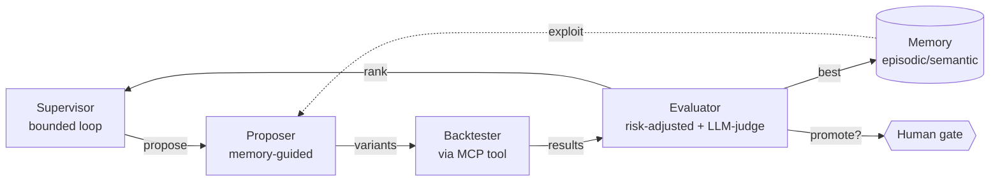

# yantra-research-lab

> **Autonomous multi-agent platform for quant strategy research.** Agents propose strategy
> variants, backtest each, judge them on risk-adjusted returns, rank, remember what worked,
> and iterate — bounded by a budget, with a human-approval gate before promotion.


Runs on a **public synthetic backtest engine** (zero proprietary IP) so anyone can reproduce it.
The production version drives a private engine — referenced here only in the abstract.

## Quickstart (no dependencies)

```bash
git clone <this-repo> && cd yantra-research-lab
python -m research_lab.run            # 4 iterations × 5 variants
python -m research_lab.run --iterations 6 --variants 6 --seed 7
```

You'll watch the loop discover a variant that **beats a deliberately-mediocre baseline** and
surface it as `promote?` — held for a human gate (nothing promotes autonomously).

## What it demonstrates (the architecture)



- **Supervisor–worker** orchestration, **bounded autonomy** (iteration/token budget)
- **Memory-guided** proposals (exploit best-so-far + explore)
- **Offline↔online parity** — every variant judged on the *same* synthetic market
- **HITL** — the top variant is `promote?`, never auto-promoted

## Repository structure (monorepo — see [ADR-0004](docs/adr/0004-monorepo-and-environment-promotion.md))

```
research_lab/          # ★ Tier-1 · the agentic engine (supervisor + agents + memory)   [runnable]
synthetic_engine/      # ★ Tier-1 · public toy backtest engine (zero IP)                [runnable]
mcp_server/            #   Tier-1 · MCP tools over the engine
tests/  eval/          #   tests + the CI eval-gate (agent-loop regression)
chatbot/               #   Tier-1/2 · RAG + dual IP/PII guardrails + RBAC
slm_regime_classifier/ #   Tier-2 · fine-tuning use case (distill→QLoRA→serve→eval-gate)
ingestion/             #   Tier-3 · multimodal document ingestion (knowledge base)
api/  frontend/        #   Tier-3 · FastAPI gateway + React retail portal
knowledge_base/        #   corpus seed-list + eval sets (raw/processed are gitignored)
infra/                 #   IaC · environments/{dev,prod}  (dev/prod = envs, not branches)
ops/                   #   observability (OTel→LangSmith/Logfire/Langfuse), scripts
docs/                  #   architecture + ADRs
.github/workflows/     #   path-filtered CI/CD: lint · test · eval-gate → dev → prod
```

## Build tiers
- **Tier 1 (this)** — autonomous research loop + MCP + eval-gate + basic guarded chatbot. *Interview-credible.*
- **Tier 2** — model routing + the fine-tuning SLM.
- **Tier 3** — A2A + AWS deploy + retail portal + full multimodal ingestion.

## Design context
Full architecture, decisions, and the honest performance picture:
`../job_profile/ai_enginerring/design_context.md` and the ADRs in [docs/adr/](docs/adr/).

## License
MIT.
</content>
