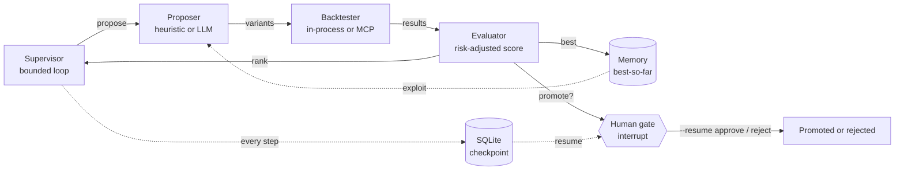

# yantra-research-lab

> **Autonomous multi-agent platform for quant strategy research.** Agents propose strategy
> variants, backtest each, score them on risk-adjusted returns, rank, remember what worked,
> and iterate for a fixed number of rounds, with a human-approval gate before promotion.

[](https://github.com/hemantsadhwani/yantra-research-lab/actions/workflows/ci.yml)


Runs on a **public synthetic backtest engine** (zero proprietary IP) so anyone can reproduce it.
The production version drives a private engine — referenced here only in the abstract.

## Quickstart: run, pause at the human gate, resume

```bash
pip install -e '.[agents]'
python -m research_lab.run_graph                  # runs the loop, then stops: PAUSED at human gate · thread <id>
python -m research_lab.run_graph --resume <id> --decision approve    # or --decision reject
python -m research_lab.run_graph --resume <id>                      # killed mid-run? continue from the last checkpoint
```

The pause is a real LangGraph interrupt persisted in a SQLite checkpoint, so the resume can come
from another shell, another process, or tomorrow. Nothing promotes until a human says so.

Three opt-in flags, on either CLI:

```bash
python -m research_lab.run_graph --memory sqlite            # persistent memory: samples from past runs' priors
python -m research_lab.run_graph --judge                    # LLM judge may veto (never promote) the top-3 candidates
python -m research_lab.run_graph --use-llm --max-usd 0.02   # LLM proposer under a hard spend cap
```

`--judge` and `--use-llm` need `pip install -e '.[llm]'` and a provider (see below). Without
one, the judge abstains and the proposer falls back to the heuristic, and the run footer counts
both, so a degraded run never looks like a clean one. Once the cap is spent the run stops early
with `stopped: budget` (tested offline in `research_lab/tests/test_budget.py`; `make demo-budget`
runs it against the real API).

## Zero-dependency path

The same loop also runs on the stdlib alone, with no install:

```bash
git clone https://github.com/hemantsadhwani/yantra-research-lab && cd yantra-research-lab
python -m research_lab.run            # 4 iterations × 5 variants
python -m research_lab.run --iterations 6 --variants 6 --seed 7
python -m research_lab.run --strategy nifty-expiry   # drive a named strategy
```

You'll watch the loop discover a variant that **beats a deliberately-mediocre baseline** and
surface it as `promote?` — held for a human gate (nothing promotes autonomously).

### Optional: put an LLM in the loop

The proposer has two implementations behind one method. The default reasons by heuristic; add
`--use-llm` and an LLM proposes the variants instead — **without changing a line of the loop**,
which is the point:

```bash
pip install -e '.[llm]'               # and set ANTHROPIC_API_KEY (or LLM_PROVIDER=ollama for local)
python -m research_lab.run --use-llm --context compacted
python -m research_lab.experiments.context_study --include-heuristic
```

**Providers:** `LLM_PROVIDER=anthropic|bedrock|ollama` (or `--provider`), routed through
[`llm_gateway/`](llm_gateway/). Every provider's output is schema-validated before the loop sees it.

The `context_study` command measures what the proposer's context actually costs — the same loop run under
three context constructions (full history / best-so-far / a compacted summary), reporting input
tokens against the best variant found. Across three seeds, **compaction held 95% of the
full-history score for 46% of the input tokens**. Raw runs and a note on what the numbers do and
do not support are in [`results/`](results/README.md). (Those numbers came from the direct
Anthropic proposer, before the gateway landed; a re-run through the gateway is pending.)

The deterministic path remains the default: no key, no network, no SDK, byte-identical output.

## One contract, two engines — the lab drives the locked IP

The real products — `nifty-weekday`, `nifty-expiry`, `sensex-expiry` — appear here **by name only**,
as synthetic stand-ins behind a single MCP contract, `run_backtest(params, strategy) → metrics`.
The **same agent loop drives either engine**: the public synthetic one you just ran, or the private
production strategies served behind the identical contract. Only the innermost **entry/exit logic is
proprietary** — protected by the contract boundary, not obfuscation, so this repo stays fully readable
and reproducible. This isn't a substitute for the real system; it's its **orchestration layer**, with
the edge swapped for a stand-in. See [architecture/01-strategy-research.md](architecture/01-strategy-research.md).

The contract is real MCP, not just a function signature. `--engine mcp` sends every backtest
over MCP stdio to `mcp_server/`, and a test asserts the results are byte-identical to the
in-process engine:

```bash
pip install -e '.[mcp]'
python -m research_lab.run --engine mcp
```

## The evaluation ladder

Each rung can only narrow what the one before it let through
([ADR-0010](docs/adr/0010-evaluation-ladder.md)):

```
verify.py (deterministic)  →  Evaluator score (arithmetic)  →  Judge veto (LLM)  →  human gate
```

The arithmetic score ranks everything. The judge can downgrade `promote?` to `hold`; it cannot
re-score, re-rank, upgrade or promote, and when it fails it abstains. The human gate is shown the
best candidate that survived the veto. A spend budget (`--max-usd`, `--max-llm-calls`) bounds
the LLM calls in both the proposer and the judge.

On the chatbot, the output filter is measured end to end with a provider scripted to leak:
**0/32 leaks reach the user with the filter on, 6/32 with it off** (`python -m eval.redteam --live`).
The leaks are hand-written, so this measures the filter's coverage, not how often a real model leaks.

## Containers and Kubernetes (the app layer)

The public demo runs on Fly.io + Vercel because that is the cheapest way to keep a portfolio app
live ([ADR-0005](docs/adr/0005-serverless-demo-aws-target.md)). The same two services are also packaged
the way a platform team would run them ([ADR-0011](docs/adr/0011-containers-and-kubernetes.md)):

```bash
docker compose up --build                       # backend :8000 + frontend :3000
docker compose --profile private up --build     # + local Ollama: the chatbot answers with no vendor API
make k8s-up && make k8s-smoke                   # kind cluster, ingress-nginx, both images, kustomize apply, GET /health
```

`deploy/k8s/` holds plain kustomize manifests: Deployments with startup/readiness/liveness probes,
resource limits and a non-root security context, Services, a CPU HPA and an Ingress. CI builds both
images and renders the manifests on every relevant change. Honest claim: *containerised, Kubernetes
manifests verified on a local cluster and in CI*, not "runs on Kubernetes in production".
See [deploy/k8s/README.md](deploy/k8s/README.md) for what is deliberately left out.

## What CI proves

| Job | What it shows |
|---|---|
| `core` (Python 3.12, 3.13) | the stdlib loop runs and passes its tests with **no extras installed**; the import-boundary tests keep langgraph, mcp, pydantic, anthropic, fastembed and logfire off the default path |
| `agents` | with `.[all]`: the LangGraph arm (checkpoint, interrupt, cross-process resume), MCP byte-identical to in-process, `llm_gateway`, memory, budget, judge (151 root tests, all offline) |
| `backend` | the FastAPI chatbot, guardrails and output filter (95 tests), plus the offline red-team block rate |
| `ingestion` | the ingestion DAG and its interrupt gate, offline (13 tests) |
| `eval-gate` | **both arms** must beat the fixed baseline: `python -m eval.run_gate --arm both` |
| red-team | block rate ≥ 80% with zero false positives on benign controls (`tests/test_redteam.py` in `core`, `python -m eval.redteam` in `backend`) |

## What it demonstrates (the architecture)


```mermaid
flowchart LR
  S[Supervisor<br/>bounded loop] -->|propose| P[Proposer<br/>heuristic or LLM]
  P -->|variants| B[Backtester<br/>in-process or MCP]
  B -->|results| E[Evaluator<br/>risk-adjusted score]
  E -->|rank| S
  E -->|best| M[(Memory<br/>best-so-far)]
  M -.exploit.-> P
  S -.every step.-> C[(SQLite<br/>checkpoint)]
  E -->|promote?| H{{Human gate<br/>interrupt}}
  H -->|--resume approve / reject| R[Promoted or rejected]
  C -.resume.-> H
```

- **Supervisor–worker** orchestration, **bounded autonomy** (fixed iteration count)
- **Memory-guided** proposals (exploit best-so-far + explore)
- **Offline↔online parity** — every variant judged on the *same* synthetic market
- **Checkpointed** — the LangGraph arm persists state after every step, so a run survives a process restart
- **HITL** — the top variant is `promote?`, and the graph interrupts until a human approves or rejects it

## Repository structure (monorepo — see [ADR-0004](docs/adr/0004-monorepo-and-environment-promotion.md))

```
research_lab/          # the agentic engine: stdlib loop + LangGraph arm (checkpoint, human gate)
synthetic_engine/      # public toy backtest engine (zero IP)
mcp_server/            # MCP server exposing run_backtest over the engine
llm_gateway/           # provider seam: Anthropic / Bedrock / Ollama, schema-validated output
backend/               # RAG chatbot with IP + PII guardrails (FastAPI → Fly.io)
frontend/              # Next.js public site (→ Vercel)
ingestion/             # LangGraph ingestion DAG for the knowledge base (daily cron)
eval/                  # CI eval-gate, guardrail red-team, chatbot eval
tests/                 # core tests
knowledge_base/        # corpus seed-list + eval sets
scripts/               # regenerate cached site data
architecture/  docs/   # system design, ADRs, design log
.github/workflows/     # CI (lint · test · eval-gate) + the daily ingestion cron
```

## What's built and what's next

[ROADMAP.md](ROADMAP.md) has two tables. **Built** lists each piece with its file path and the
one command that proves it. **Phase 2** lists what is designed but not built (auth + RBAC,
retail portal, model routing, the fine-tuned SLM, IaC environments, and more). The web app is
a live app (deployed, traced, observable), not a live product. It has no real user traffic,
and nothing here claims otherwise.

## Architecture
Full system design across all subsystems — strategy research, ingestion, memory, guardrails,
frontend, observability, model routing, deployment: the [architecture/](architecture/) docs and
the decision records in [docs/adr/](docs/adr/). The ongoing decision journal — context and
trade-offs as the project evolves — is in [docs/DESIGN_LOG.md](docs/DESIGN_LOG.md).

## License
MIT.
</content>
