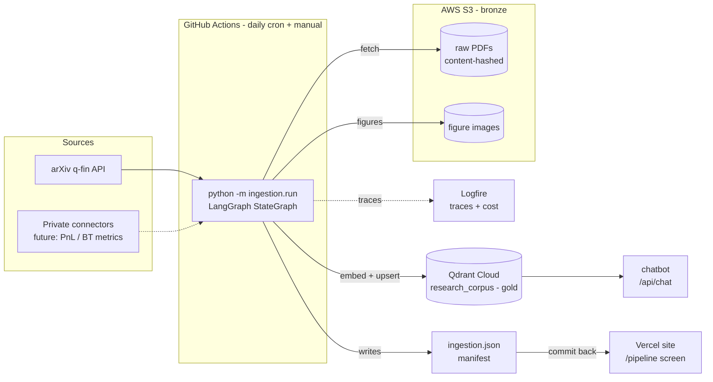
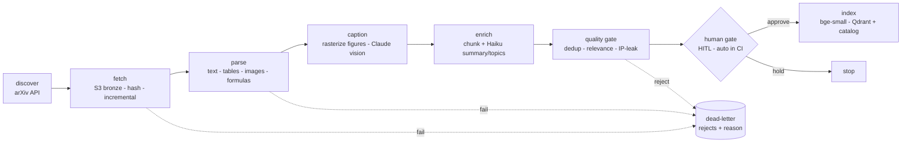
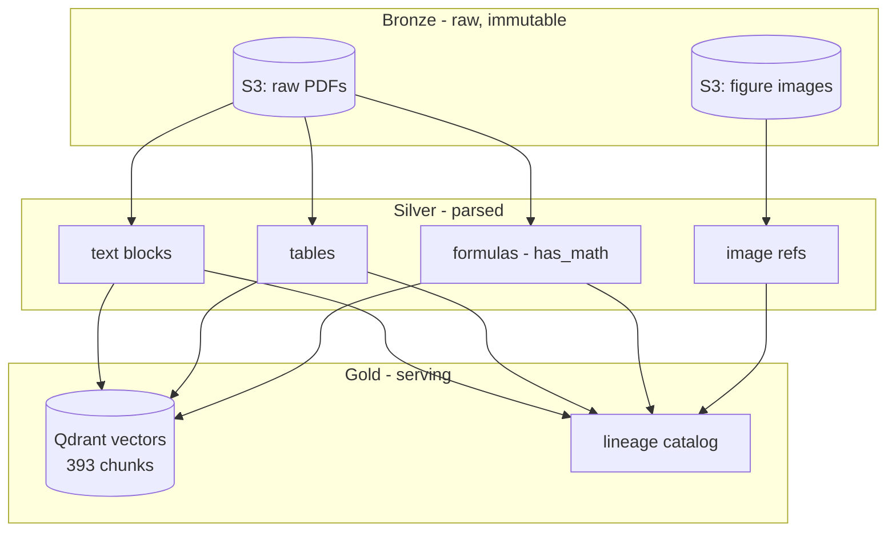

# 02a · Data Ingestion — **AS-BUILT (LIVE)**

The near-zero-cost Tier-3 pipeline that is actually running in production (2026-07-05).
Companion to the aspirational scale design in [02-data-ingestion.md](02-data-ingestion.md):
this documents what *shipped* — a complete, cloud-hosted, automated data platform built
for pennies. (Target-scale extras — GPU inference tier, ColQwen visual retrieval,
verification loop — are deliberately deferred; see that doc.)

> **Diagrams below are Mermaid.** In excalidraw.com use **≡ menu → "Mermaid to Excalidraw"**
> (or the "+" insert) and paste a block to get editable shapes.

## The stack (every layer real + live)

| Layer | Implementation | Status |
|---|---|---|
| Source discovery | arXiv q-fin API (`discover.py`) | LIVE |
| Orchestration | LangGraph StateGraph — retries, dead-letter, HITL gate (`graph.py`) | LIVE |
| Object storage (bronze) | **AWS S3** `yantra-research-lab-data` (ap-south-1), IAM least-privilege, public-access blocked | LIVE |
| Compute | **GitHub Actions** — daily cron + manual, native runner, **3m6s/run**, ~$0 | LIVE |
| Parse (silver) | PyMuPDF text+tables+images, formula heuristic, Tesseract OCR fallback | LIVE |
| Figure captioning (multimodal) | Caption-anchored figure rasterization → **Claude vision** caption → embedded for retrieval (sub-project A) | LIVE |
| Enrich | Chunk + Claude Haiku summary/topics, USD-budget-bounded | LIVE |
| Quality gate | dedup · relevance · IP-leak quarantine (dead-letter) | LIVE |
| Vector DB (gold) | Qdrant Cloud `research_corpus` — 393 chunks | LIVE |
| Observability | Logfire — run + per-LLM-call traces, per-run cost | LIVE |
| Public UI | `/pipeline` — DAG, lineage, dead-letter; auto-redeployed on manifest commit | LIVE |

First native run: **10 papers · 16 tables · 6 images · 428 chunks → 393 indexed · $0.0082 · 148.9s.**

## System architecture

## Pipeline DAG (LangGraph)

## Medallion data flow

## Data-engineering properties (what a reviewer looks for)

- **Medallion** bronze/silver/gold · **idempotent + incremental** (content-hash; daily re-run reprocesses only changes)
- **Data contracts** — pydantic at every stage boundary (`state.py`)
- **Retries + checkpointing** (LangGraph `RetryPolicy`, fetch backoff) · **dead-letter** with reasons, never silent drops
- **Governance** — IP-leak quality gate enforces the privacy boundary for future private sources
- **Lineage** — per-doc provenance in catalog + public manifest
- **Observability** — Logfire traces + per-run cost · **FinOps** — offline batch, Haiku-only, hard USD budget, cached artifact
- **Blue/green data** — writes `research_corpus`, separate from live `methodology`
- **Separation of concerns** — ingestion is its own component; heavy parsers never enter the serving container
- **CI/CD data pipeline** — scheduled ephemeral compute, auto-commits manifest → auto-redeploys UI

## Cost

Batch + incremental + Haiku + cached manifest ⇒ **~$0.008 per full run**, **~$0 on unchanged days**,
free CI minutes, S3 pennies. No always-on compute (deliberately not EC2).

## Infra reference

- S3: `s3://yantra-research-lab-data/yantra-corpus/` (ap-south-1), IAM user `yantra-ingest` (S3-only)
- CI: `.github/workflows/ingest.yml` (`ingest-corpus`), 8 repo secrets
- Qdrant collection `research_corpus`; embed `BAAI/bge-small-en-v1.5` (must match serving)
- Live: [/pipeline](https://yantra-research-lab.vercel.app/pipeline)

## Roadmap (documented upgrades)

- **Sub-project A — Images**: ✅ SHIPPED — caption-anchored figure rasterization → S3 bronze +
  committed thumbnails → Claude-vision caption → embedded in `research_corpus` (multimodal retrieval)
- **Sub-project B — Tables → Text-to-SQL**: structured tables → DuckDB → schema-linked LLM SQL agent
  with execution-feedback self-correction + read-only guardrails (automates reporting)
- High-fidelity math (Nougat/Mathpix), GraphRAG, CLIP visual retrieval, private strategy-metrics connector
