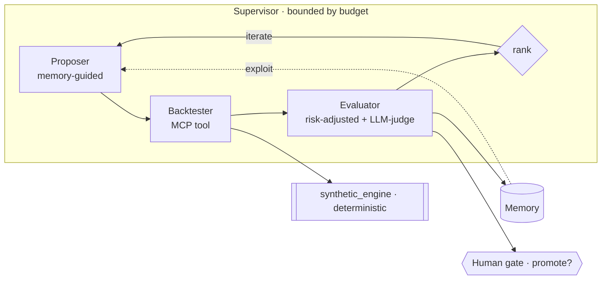
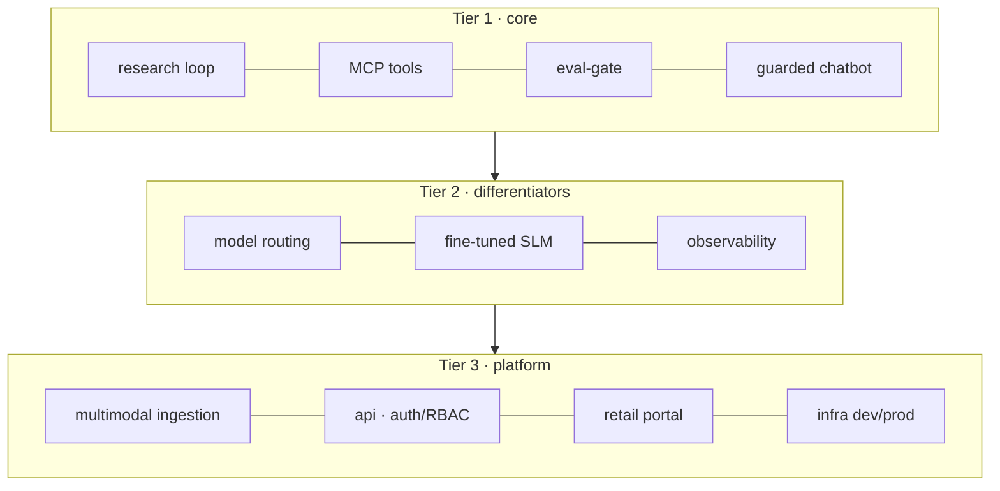

# Architecture

Production-grade design for **yantra-research-lab** — an autonomous multi-agent platform for
quant strategy research, plus the knowledge, guardrail, and delivery layers around it. Each
document below states the *decision, the why, and the cost/latency/scale/reliability trade-off*
(the ADR lens). The public build runs on a **synthetic engine** (zero proprietary IP); the
production version drives a private strategy engine, referenced here only in the abstract.

## The system in two diagrams

**The autonomous research loop**

**The product (monorepo tiers)**

## Index
| # | Document | Subsystem |
|---|---|---|
| 01 | [strategy-research](01-strategy-research.md) | the agentic research loop |
| 02 | [data-ingestion](02-data-ingestion.md) | multimodal near-zero-error pipeline |
| 03 | [memory](03-memory.md) | episodic / semantic / procedural agent memory |
| 04 | [guardrails-rbac](04-guardrails-rbac.md) | IP + PII guardrails, RBAC, leak-rate eval |
| 05 | [frontend-product](05-frontend-product.md) | product taxonomy, UI, plan-vs-actual |
| 06 | [observability](06-observability.md) | OTel → LangSmith/Logfire/Langfuse, evals + drift |
| 07 | [model-routing-finetune](07-model-routing-finetune.md) | LLM gateway + SLM distillation |
| 08 | [deployment-aws](08-deployment-aws.md) | AWS, monorepo, dev→prod promotion |

Decision records: [../docs/adr/](../docs/adr/).

## Design principles
1. **Workflow-first, agentic only where the problem demands it** — bounded autonomy; pay for it knowingly.
2. **Keep the LLM off the hot path** — deterministic control where latency matters.
3. **Deterministic fallbacks** around every probabilistic component.
4. **Eval-gate everything** — offline↔online parity; never ship a regression.
5. **Cost/compliance by routing** — cheap-local first, escalate to frontier models only where needed.
</content>
