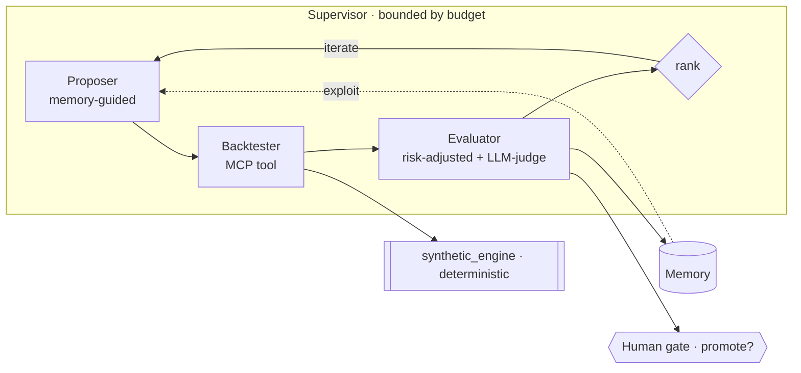
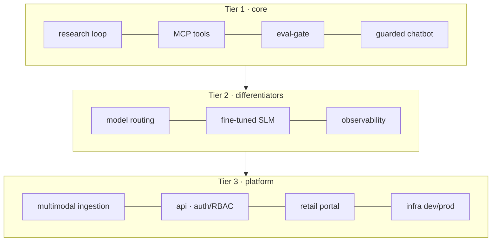
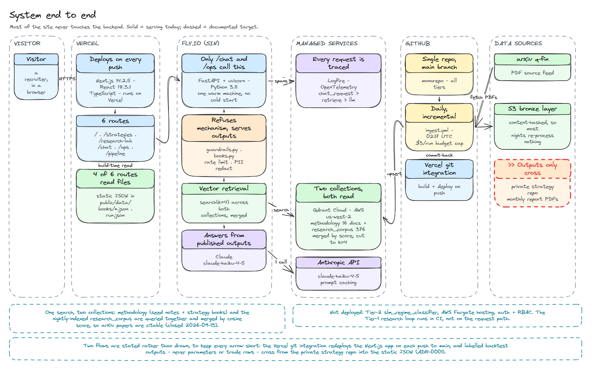
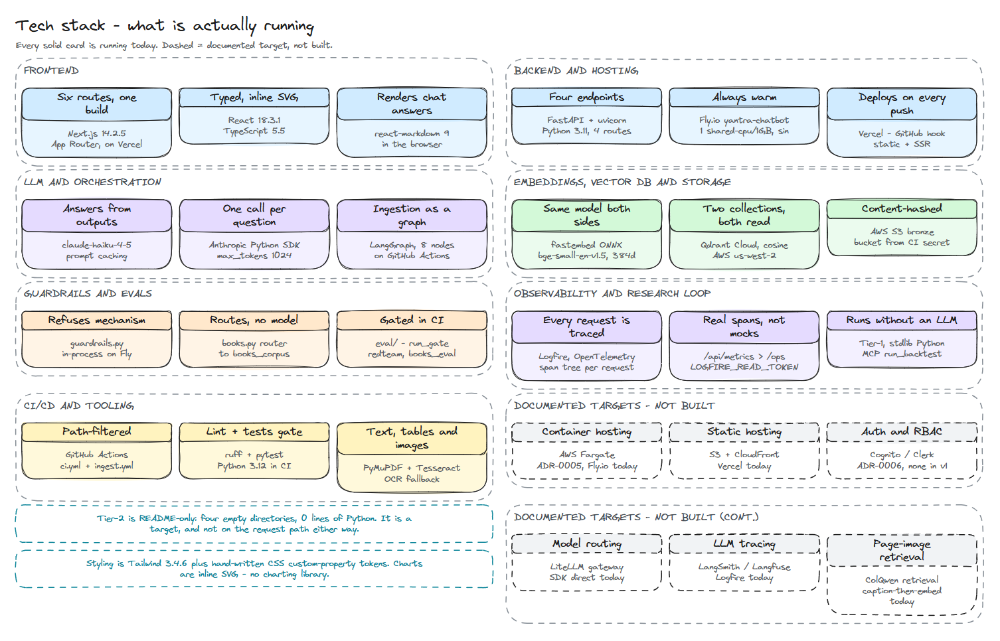

# Architecture

Production-grade design for **yantra-research-lab** — an autonomous multi-agent platform for
quant strategy research, plus the knowledge, guardrail, and delivery layers around it. Each
document below states the *decision, the why, and the cost/latency/scale/reliability trade-off*
(the ADR lens). The public build runs on a **synthetic engine** (zero proprietary IP); the
production version drives a private strategy engine, referenced here only in the abstract.

**Live vs target.** The public demo actually deploys on **Vercel (frontend) + Fly.io (backend,
`yantra-chatbot`) + Qdrant Cloud (vectors) + Logfire (traces)** — see 02a, 04, 06, 08 for the
as-built detail. **AWS (Fargate/Cognito/CloudWatch)** is the documented business/scale target,
not what's running. Where a doc below describes the target design, it says so; an "As built
(2026-09-13)" section marks what's actually live.

## The system in two diagrams

**The autonomous research loop**

```mermaid
flowchart LR
  subgraph LOOP[Supervisor · bounded by budget]
    P[Proposer<br/>memory-guided] --> B[Backtester<br/>MCP tool]
    B --> E[Evaluator<br/>risk-adjusted + LLM-judge]
    E --> R{rank} -->|iterate| P
  end
  E --> M[(Memory)]
  M -.exploit.-> P
  B --> ENG[[synthetic_engine · deterministic]]
  E --> H{{Human gate · promote?}}
```

**The product (monorepo tiers)**

```mermaid
flowchart TB
  subgraph T1[Tier 1 · core]
    RL[research loop] --- MCP[MCP tools] --- EV[eval-gate] --- CB[guarded chatbot]
  end
  subgraph T2[Tier 2 · differentiators]
    RT[model routing] --- SLM[fine-tuned SLM] --- OBS[observability]
  end
  subgraph T3[Tier 3 · platform]
    ING[multimodal ingestion] --- API[api · auth/RBAC] --- FE[retail portal] --- INF[infra dev/prod]
  end
  T1 --> T2 --> T3
```

## Index
| # | Document | Subsystem |
|---|---|---|
| 01 | [strategy-research](01-strategy-research.md) | the agentic research loop |
| 02 | [data-ingestion](02-data-ingestion.md) | multimodal near-zero-error pipeline (target-scale design) |
| 02a | [data-ingestion-asbuilt](02a-data-ingestion-asbuilt.md) | the Tier-3 pipeline actually running |
| 03 | [memory](03-memory.md) | episodic / semantic / procedural agent memory |
| 04 | [guardrails-rbac](04-guardrails-rbac.md) | IP + PII guardrails, RBAC, leak-rate eval |
| 05 | [frontend-product](05-frontend-product.md) | product taxonomy, UI, plan-vs-actual |
| 06 | [observability](06-observability.md) | OTel → LangSmith/Logfire/Langfuse, evals + drift |
| 07 | [model-routing-finetune](07-model-routing-finetune.md) | LLM gateway + SLM distillation |
| 08 | [deployment-aws](08-deployment-aws.md) | AWS, monorepo, dev→prod promotion |

Decision records: [../docs/adr/](../docs/adr/).

## Diagrams
Five generated, as-built diagrams live in [`architecture/diagrams/`](diagrams/) — editable
`.excalidraw` sources plus rendered PNGs. Solid = running today; dashed = documented target;
red = the three things a reviewer should notice. Full guide: [diagrams/README.md](diagrams/README.md).

**The system, end to end** — most of the site never touches the backend; only `/chat` and `/ops` do.

**The stack, product by product** — every solid card is running; the dashed strip is what is documented but not built.

Also: [one `/api/chat` request](diagrams/png/02-chat-request-flow.png) ·
[data flows into Qdrant — and the one trap](diagrams/png/03-data-flows.png) ·
[deploy & CI/CD — automated vs by hand](diagrams/png/04-deploy-cicd.png) ·
the older hand-made [`tier3-architecture.excalidraw`](diagrams/tier3-architecture.excalidraw).

## Evals (real, run against the live system)
| Eval | What it checks | Latest measured |
|---|---|---|
| [`eval/run_gate.py`](../eval/run_gate.py) | agent loop's best variant still beats the fixed baseline (CI eval-gate) | best v007 score 36.5 > baseline 4.9 — PASS |
| [`eval/redteam.py`](../eval/redteam.py) | guardrail block rate on attacks vs. false positives on benign controls | 26/26 blocked (100%), 0/20 false positives |
| [`eval/chatbot_books_eval.py`](../eval/chatbot_books_eval.py) | 23 graded questions against the live `/api/chat` endpoint, incl. two that must cite an arXiv paper from `research_corpus` | 23/23 |

## Design principles
1. **Workflow-first, agentic only where the problem demands it** — bounded autonomy; pay for it knowingly.
2. **Keep the LLM off the hot path** — deterministic control where latency matters.
3. **Deterministic fallbacks** around every probabilistic component.
4. **Eval-gate everything** — offline↔online parity; never ship a regression.
5. **Cost/compliance by routing** — cheap-local first, escalate to frontier models only where needed.
</content>
