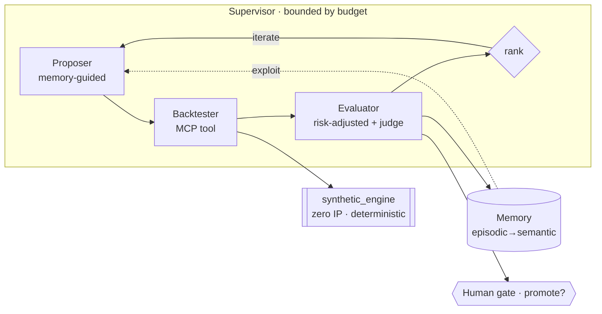
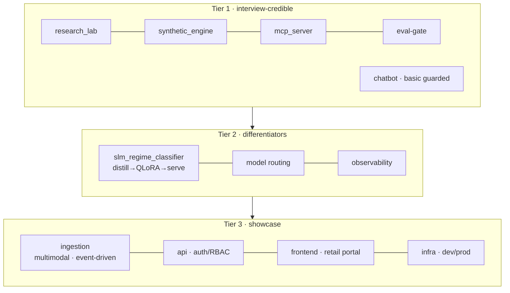

# Architecture

## The autonomous research loop (Tier-1, runnable)



## The product (monorepo tiers)



## CI/CD (path-filtered, environment promotion)

```
PR/merge → [changed?] → lint · test · eval-gate → deploy DEV → (manual approval) → PROD
```
Dev/prod are **environments**, not branches. See [adr/0004](adr/0004-monorepo-and-environment-promotion.md).

## ADRs
- [0001](adr/0001-public-synthetic-engine.md) public synthetic engine · [0002](adr/0002-mcp-wrap-the-engine.md) MCP-wrap ·
  [0003](adr/0003-bounded-autonomy.md) bounded autonomy · [0004](adr/0004-monorepo-and-environment-promotion.md) monorepo + env promotion.
</content>
